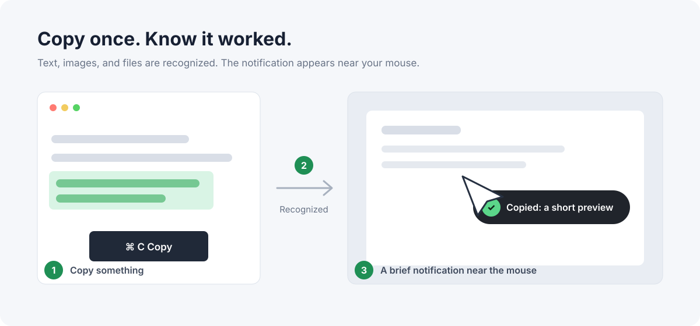

# CopyPop

<table>
  <tr>
    <td><strong>English</strong></td>
    <td><a href="README.zh-CN.md">简体中文</a></td>
  </tr>
</table>

> A tiny native copy notification for Windows and macOS.



CopyPop shows a short notification near your mouse whenever you copy text, an image, or a file. It stays in the system tray or menu bar, never steals focus, and does not save clipboard history.

## Download and run on Windows

1. Open the [Windows release](https://github.com/suran662/CopyPop/releases/tag/v0.1.0).
2. Under **Assets**, choose the interface language:
   - English: `CopyPop-Windows-x64-en.exe`
   - Simplified Chinese: `CopyPop-Windows-x64-zh-CN.exe`
3. When the download finishes, double-click the `.exe` file.
4. If Windows SmartScreen appears, click **More info** → **Run anyway**.
5. Look for the CopyPop icon near the clock. Copy something to try it.

Supports 64-bit Windows 10 and Windows 11.
The interface language is fixed in each package.

## Download and run on macOS

1. Open the [latest release](https://github.com/suran662/CopyPop/releases/latest).
2. Under **Assets**, click `CopyPop-macOS-arm64-en.zip` for the English build.
3. Double-click the ZIP, then drag `CopyPop.app` into **Applications**.
4. The first time you open it, right-click `CopyPop.app` and choose **Open**.
5. Look for the CopyPop icon in the menu bar. Copy something to try it.

Supports Apple silicon Macs (M1, M2, M3, M4, and later) running macOS 11 or later.
The language is fixed in each package; use the `zh-CN` asset for Simplified Chinese.

## What you will see

| What you copy | Notification |
| --- | --- |
| Text | A short text preview |
| Image | “Image copied” |
| One file | The file name |
| Multiple files | The number of files |

The notification disappears after about 0.65 seconds. It does not steal keyboard focus or block mouse clicks.

## Quit or remove CopyPop

- **Windows:** right-click the CopyPop tray icon and choose **Exit CopyPop**. Delete the `.exe` if you no longer want it.
- **macOS:** click the CopyPop menu bar icon and choose **Quit CopyPop**. Delete the app from **Applications** if you no longer want it.

## Privacy

- Everything runs locally; CopyPop does not connect to the internet.
- Clipboard history is never saved.
- Clipboard contents are never changed.
- Both apps use native system APIs—there is no embedded browser runtime.

## Build from source

On macOS, install Xcode Command Line Tools and run:

```bash
scripts/build-macos.command en
```

On Windows, install Microsoft C++ Build Tools, MinGW-w64, or LLVM-MinGW, then run in PowerShell:

```powershell
.\scripts\build-windows.ps1 en
```

To create both macOS release archives, run `scripts/package-macos.command`.

## License

[MIT](LICENSE)
